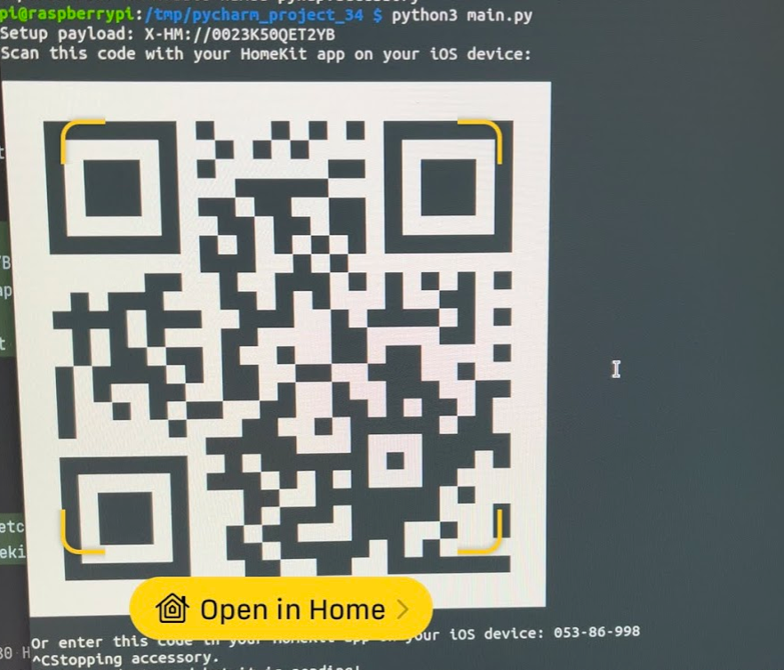

# Introduction

Simple script to add BME680 sensor readings to Apple Homekit using a Raspberry PI with minimal configuration.

After running the program you'll be given the QR code used to add the sensor as an accessory in Homekit.




## Installing

Ensure you are the `pi` user. Clone the repo in home and then install requirements.

### Cloning the project

```bash
cd /home/pi && git clone git@github.com:dnutiu/bme680-homekit.git && cd bme680-homekit
sudo apt-get install libavahi-compat-libdnssd-dev
pip3 install -r requirements.txt
```

### Sensors

The `sensors` directory contains code for operating the bme680 sensor. 

The sensor values are collected and exposed in HomeKit and as prometheus metrics. 
The prometheus metrics can be accessed on port `8000`.

Run the program once to pair it with your ios. ex:

```bash
cd sensors
python3 main.py 
Setup payload: X-HM://0023K50QET2YB
Scan this code with your HomeKit app on your iOS device:

Or enter this code in your HomeKit app on your iOS device: 053-86-998

```

Copy the systemd service.

```bash
sudo cp bme680-homekit.service /etc/systemd/system
sudo systemctl status bme680-homekit
```

```
● bme680-homekit.service - Bme680 Homekit service
     Loaded: loaded (/etc/systemd/system/bme680-homekit.service; disabled; vendor preset: enabled)
     Active: inactive (dead)
```

Start the service
```bash
sudo systemctl start bme680-homekit
sudo systemctl status bme680-homekit
```

```
● bme680-homekit.service - Bme680 Homekit service
     Loaded: loaded (/etc/systemd/system/bme680-homekit.service; disabled; vendor preset: enabled)
     Active: active (running) since Mon 2022-02-21 20:10:30 GMT; 935ms ago
   Main PID: 1722 (python3)
      Tasks: 1 (limit: 780)
        CPU: 895ms
     CGroup: /system.slice/bme680-homekit.service
             └─1722 /usr/bin/python3 /home/pi/bme680-homekit/main.py

Feb 21 20:10:30 raspberrypi systemd[1]: Started Bme680 Homekit service.
```

### Prometheus

Prometheus is a system for monitoring and alerting. To install it run `prometheus./install.sh`.

Prometheus server will listen on port `:9090`

### Grafana 

Grafana can be used to create dashboard and visualise prometheus metrics. To install it run `grafana/install.sh`

Grafana is accessible on port `:80`.
