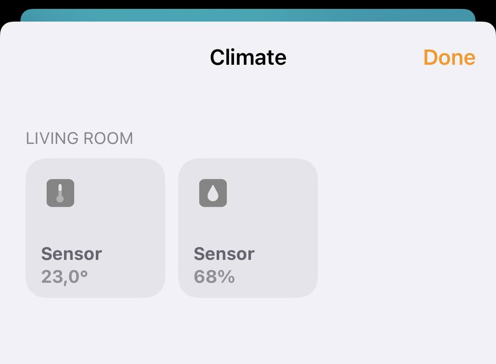
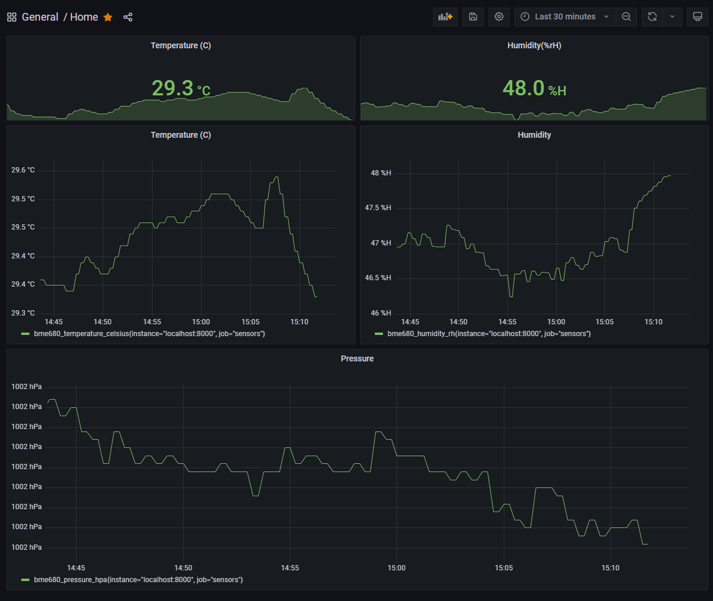

# Introduction

Simple script utilities to add BME680 sensor readings to Apple Homekit using a Raspberry PI with minimal configuration.

After running the program you'll be given the QR code used to add the sensor as an accessory in Homekit.




## Installing

Ensure you are the `pi` user. Clone the repo in home and then install requirements.

### Cloning the project

```bash
cd /home/pi && git clone git@github.com:dnutiu/bme680-homekit.git && cd bme680-homekit
sudo apt-get install libavahi-compat-libdnssd-dev
pip3 install -r requirements.txt
```

### Application

The `app` directory contains the source code of this application

Sensor values are collected and exposed in HomeKit and as prometheus metrics.

By default, metrics can be accessed on port `8000`.


### Configuration

Before running the program edit the `config.yaml` file and replace at least `persist_file` field.

The program will search for the `config.yaml` file in the current directory but this can be configured to another directory
by settings the `HOMEKIT_CONFIG` environment variable.

### Running

Run the program once to pair it with your ios. ex:

```bash
python3 -m app.main 
Setup payload: X-HM://0023K50QET2YB
Scan this code with your HomeKit app on your iOS device:

Or enter this code in your HomeKit app on your iOS device: 053-86-998

```

### SystemD Service

Edit `./systemd/bme680-homekit.service` and replace relevant variables such as `WorkingDirectory`, `ExecStart`
and `User`.

Run `sudo ./systemd/install.sh` to install SystemD service automatically on your system.

Or follow the manual steps.

Copy the systemd service.

```bash
sudo cp ./systemd/bme680-homekit.service /etc/systemd/system
sudo systemctl status bme680-homekit
```

```
● bme680-homekit.service - Bme680 Homekit service
     Loaded: loaded (/etc/systemd/system/bme680-homekit.service; disabled; vendor preset: enabled)
     Active: inactive (dead)
```

Start the service

```bash
sudo systemctl start bme680-homekit
sudo systemctl status bme680-homekit
```

```
● bme680-homekit.service - Bme680 Homekit service
     Loaded: loaded (/etc/systemd/system/bme680-homekit.service; disabled; vendor preset: enabled)
     Active: active (running) since Mon 2022-02-21 20:10:30 GMT; 935ms ago
   Main PID: 1722 (python3)
      Tasks: 1 (limit: 780)
        CPU: 895ms
     CGroup: /system.slice/bme680-homekit.service
             └─1722 /usr/bin/python3 /home/pi/bme680-homekit/main.py

Feb 21 20:10:30 raspberrypi systemd[1]: Started Bme680 Homekit service.
```

## Troubleshooting

If you get an error for FileNotFound:

```
Traceback (most recent call last):
  File "/home/denis/bme680-homekit/sensors/main.py", line 112, in <module>
    driver.add_accessory(accessory=get_bridge(driver))
  File "/home/denis/bme680-homekit/sensors/main.py", line 101, in get_bridge
    bridge.add_accessory(Bme680Sensor(accessory_driver, "Sensor"))
  File "/home/denis/bme680-homekit/sensors/main.py", line 33, in __init__
    self.sensor = bme680.BME680(bme680.I2C_ADDR_PRIMARY)
  File "/home/denis/.local/lib/python3.9/site-packages/bme680/__init__.py", line 43, in __init__
    self._i2c = smbus.SMBus(1)
FileNotFoundError: [Errno 2] No such file or director
```

You will need to active I2C interface with `sudo raspi-config` -> Interfacing -> I2C

### Prometheus

Prometheus is a system for monitoring and alerting. 

Before installing Prometheus you will need to tweak the `prometheus/prometheus.service` file, especially the config
file and storage path since they contain the hardcoded string: `/home/pi/bme680-homekit/`.

To install it run `prometheus./install.sh`.

Prometheus server will listen on port `:9090`

### Grafana

Grafana can be used to create dashboard and visualise prometheus metrics. To install it run `grafana/install.sh`

Grafana is accessible on port `:80`. Premade dashboards can be found in the `grafana/dashboards` folder.


